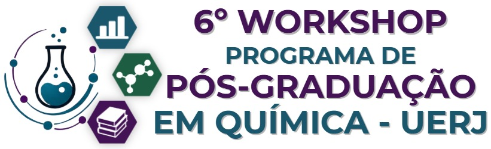
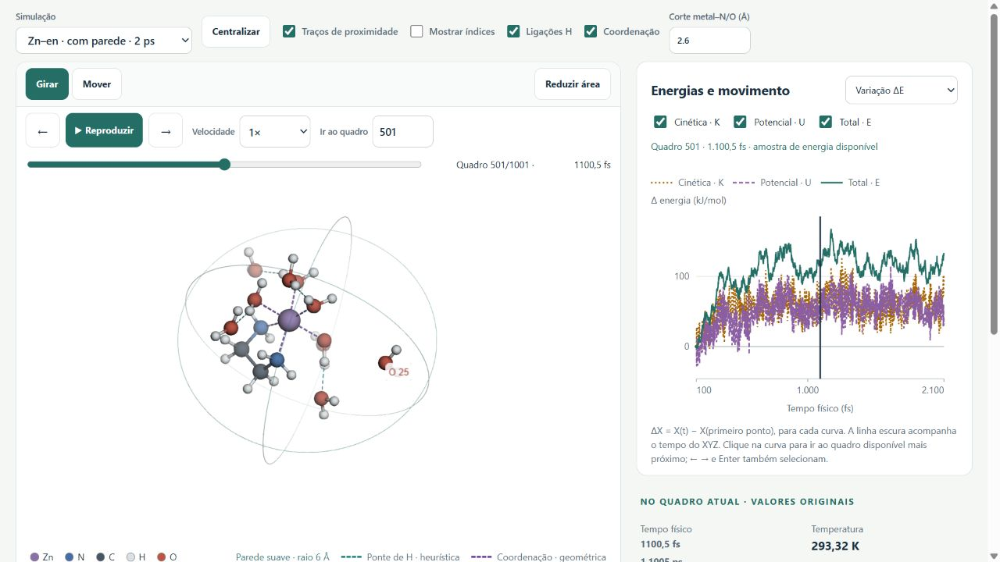
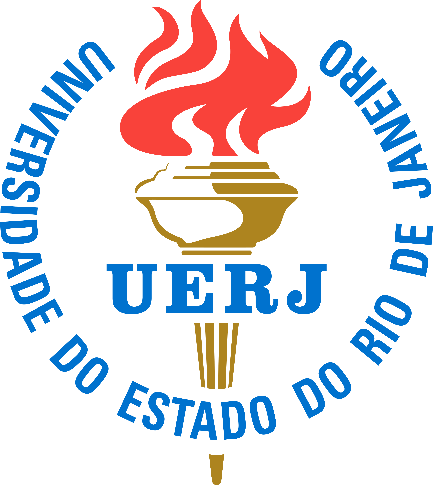
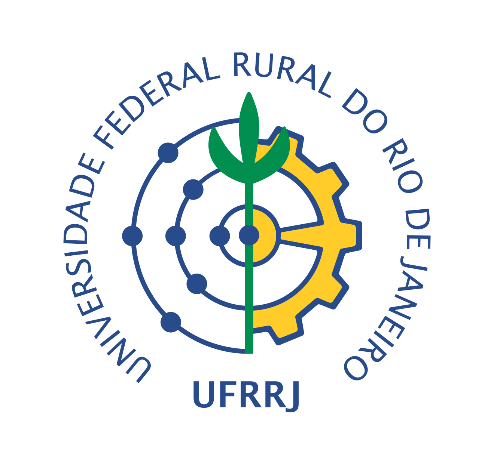

  

<h1 align="center">Dinâmica molecular com ORCA</h1>

<strong>Do input à interpretação. Química em movimento.</strong> 
7 de outubro de 2026 · remoto · 13h–16h e 17h–18h · Brasília

Henrique de Castro Silva Junior · Virginia Camila Rufino Ferreira

  
  
  

**[Guia interativo dos parâmetros de `%md` →](https://henriquecsj.github.io/AIMD-6WPPQG-UERJ/guia-md/)** · Explicações, busca e exemplos copiáveis. Disponível também no topo do laboratório e no menu dos exercícios. [Arquivos do guia](guia-md/README.md).

### Seu ponto de partida

**Antes da aula:** [prepare e teste o ORCA](tutoriais/README.md). Recomendamos **WSL2 + Ubuntu**, com instruções desde a instalação do WSL. Há também uma rota para Windows nativo.

**Durante a aula:** [abra os exercícios](https://henriquecsj.github.io/AIMD-6WPPQG-UERJ/exercicios/). Cada atividade traz uma pergunta química, input comentado para copiar, estruturas e resultados de referência.

### Um laboratório no seu navegador

O laboratório abre na trajetória 3D. Gire ou arraste a molécula, amplie a área e acompanhe o quadro atual nas curvas de energia cinética, potencial, total e temperatura. Meça também distâncias, ângulos e diedros. Abra um exemplo pronto ou carregue `.out`, `-md-ener.csv` e `-traj.xyz`. **Seus arquivos são lidos localmente**, sem conta e sem instalação.

**[Explorar a hidratação do Zn²⁺ →](https://henriquecsj.github.io/AIMD-6WPPQG-UERJ/visualizador/?exemplo=zn_hydration&aba=trajetoria)**

A imagem acima conserva uma prévia anterior do complexo pré-formado. O bloco atual começa pelo Zn²⁺ isolado e 20 águas, sem en.

### Durante a aula: cinco blocos

1. **[Água: da molécula à ligação H](exercicios/1-agua-dft/README.md)** — [01a: movimento, energia e temperatura](exercicios/1-agua-dft/README.md#agua-isolada) → [01b: dímero e reorientação](exercicios/1-agua-dft/README.md#dimero).
2. **[Etanol e timestep](exercicios/3-xtb2-etanol/README.md)** — controle, instabilidade e correção.
3. **[Aquecer e resfriar](exercicios/5-termostato/README.md)** — termostato, diedro e etapas contínuas.
4. **[Zn²⁺ → águas → en](exercicios/6-complexo-solvator/README.md)** — SOLVATOR adiciona 20 águas ao íon isolado; compare hidratação sem en e rigidez da parede; depois observe o [primeiro N assistido e o segundo N livre](exercicios/11-formacao-quelato/README.md) em uma referência independente. Em [04d](exercicios/14-zn-en-pressao/README.md), compare en sem assistência sob alvos de **1, 1000 e 4000 bar**.
5. **[H₅O₂⁺](exercicios/10-proton-compartilhado/README.md)** — um próton compartilhado entre duas águas.

**[Opcionais e referências](exercicios/README.md#opcionais-e-referencias):** DFT/CPCM, gotas protonadas de 300 a 600 K, água em C₆₀ e outros controles. A lista do laboratório separa estes materiais do percurso da aula.

A abertura usa uma trajetória DFT de água isolada já calculada para aprender as medidas e relacionar movimento, energia e temperatura. As execuções propostas usam **GFN2-xTB (`XTB2`)**: o primeiro par compara NVE e CSVR; depois passamos à ligação H no dímero. A água também introduz a relação entre vibração, IV e Raman. Os resultados fornecidos permitem acompanhar a aula mesmo quando uma execução local demora.

**[Baixar os materiais (.zip)](https://github.com/HenriqueCSJ/AIMD-6WPPQG-UERJ/archive/refs/heads/main.zip)** · [Roteiro e horários](exercicios/roteiro-4h.md) · [Downloads oficiais](tutoriais/04-links-e-referencias.md)

---

 &nbsp;&nbsp;&nbsp; 

Moderação: Prof. Haroldo Candal · <a href="https://www.ppgq-iq.uerj.br/6o-workshop-do-programa-de-pos-graduacao-em-quimica-uerj">Programação do evento</a> O acesso à sala é enviado pela organização.

[Licença dos materiais](LICENSE) · [Créditos das marcas](assets/README.md). O ORCA é obtido separadamente, sob seus próprios termos.
